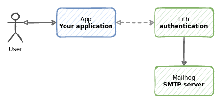

First, make sure to run `make docker-image` in the projects main directory. This will build a docker image called `lith`.

Run `docker-compose up` to start the application. You can use `-d` flag to run it in the background.

    % docker-compose up
    Starting go_reverseproxy_mailhog_1    ... done
    Starting go_reverseproxy_app_1        ... done
    Starting go_reverseproxy_lith-admin_1 ... done
    Starting go_reverseproxy_lith_1       ... done
    Attaching to go_reverseproxy_mailhog_1, go_reverseproxy_lith-admin_1, go_reverseproxy_app_1, go_reverseproxy_lith_1
    app_1         | running on 0.0.0.0:8000
    mailhog_1     | 2021/12/09 08:49:49 Using in-memory storage
    mailhog_1     | 2021/12/09 08:49:49 [SMTP] Binding to address: 0.0.0.0:1025
    mailhog_1     | [HTTP] Binding to address: 0.0.0.0:8025
    go_reverseproxy_lith-admin_1 exited with code 0
    mailhog_1     | 2021/12/09 08:49:49 Serving under http://0.0.0.0:8025/
    mailhog_1     | Creating API v1 with WebPath:
    mailhog_1     | Creating API v2 with WebPath:

When successful, several services will be running.

* A Go application running on http://localhost:8000 All requests prefixed with `/account/` path are being proxied to Lith.
* A Lith instance is running. Only admin panel is publicly available at http://localhost:8003/admin/
* A [Mailhog](https://github.com/mailhog/MailHog) test SMTP server [with a web UI running at http://localhost:8025](http://localhost:8025).

During startup an admin account `admin@example.com` with password `admin` is created. You can use it to login.

For convenience, two-factor authentication is disabled. You can enable it in the `lith.conf` by setting `RequireTwoFactorAuth = true`. Enabling two-factor authentication can be done at any time - existing accounts will be requested to update during authentication.

    % docker-compose ps
    Name                          Command               State                          Ports
    ---------------------------------------------------------------------------------------------------------------------------
    go_reverseproxy_app_1          ./app                            Up       0.0.0.0:8000->8000/tcp,:::8000->8000/tcp
    go_reverseproxy_lith-admin_1   /bin/lith -conf /etc/lith. ...   Exit 0
    go_reverseproxy_lith_1         /bin/lith -conf /etc/lith. ...   Up       0.0.0.0:8003->8003/tcp,:::8003->8003/tcp
    go_reverseproxy_mailhog_1      MailHog                          Up       1025/tcp, 0.0.0.0:8025->8025/tcp,:::8025->8025/tcp

### How it works.

When you go to http://localhost:8000, Go application will check if you have an active session by introspecting your cookies. If you provide a session cookie, a call to Lith is made to validate and introspect your token.
If you are not authenticated, Go application will display a link to Lith authentication page where you can authenticate. All requests to Lith are proxied by Go application. End user cannot notice that authentication is done by a separate application.
