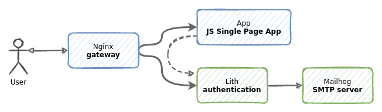

First, make sure to run `make docker-image` in the projects main directory. This will build a docker image called `lith`.

Run `docker-compose up` to start the application. You can use `-d` flag to run it in the background.

    % docker-compose up
    Starting js_spa_lith-admin_1 ... done
    Starting js_spa_mailhog_1    ... done
    Starting js_spa_lith_1       ... done
    Starting js_spa_frontend_1   ... done
    Attaching to js_spa_lith-admin_1, js_spa_mailhog_1, js_spa_lith_1, js_spa_frontend_1
    frontend_1    | /docker-entrypoint.sh: /docker-entrypoint.d/ is not empty, will attempt to perform configuration
    frontend_1    | /docker-entrypoint.sh: Looking for shell scripts in /docker-entrypoint.d/
    mailhog_1     | [HTTP] Binding to address: 0.0.0.0:8025
    frontend_1    | /docker-entrypoint.sh: Launching /docker-entrypoint.d/10-listen-on-ipv6-by-default.sh
    js_spa_lith-admin_1 exited with code 0
    frontend_1    | 10-listen-on-ipv6-by-default.sh: error: IPv6 listen already enabled
    mailhog_1     | 2021/12/09 09:42:33 Using in-memory storage
    mailhog_1     | 2021/12/09 09:42:33 [SMTP] Binding to address: 0.0.0.0:1025
    mailhog_1     | 2021/12/09 09:42:33 Serving under http://0.0.0.0:8025/
    frontend_1    | /docker-entrypoint.sh: Launching /docker-entrypoint.d/20-envsubst-on-templates.sh
    frontend_1    | /docker-entrypoint.sh: Configuration complete; ready for start up
    mailhog_1     | Creating API v1 with WebPath:
    mailhog_1     | Creating API v2 with WebPath:

When successful, several services will be running.

* Nginx is running on port 8000 and serving all the traffic.
* A JavaScript Single Page Application is running and [you can access it via Nginx](http://localhost:8000). This is where your business logic would be.
* A Lith instance is running and you can access it via Nginx. Admin panel at http://localhost:8000/admin/
* A [Mailhog](https://github.com/mailhog/MailHog) test SMTP server [with web a UI running at http://localhost:8025](http://localhost:8025).

During startup an admin account `admin@example.com` with password `admin` is created. You can use it to login.

For convenience, two-factor authentication is disabled. You can enable it in the `lith.conf` by setting `RequireTwoFactorAuth = true`. Enabling two-factor authentication can be done at any time - existing accounts will be requested to update during authentication.

    % docker-compose ps
    Name                      Command               State                          Ports
    ------------------------------------------------------------------------------------------------------------------
    js_spa_frontend_1     /docker-entrypoint.sh ngin ...   Up       0.0.0.0:8000->80/tcp,:::8000->80/tcp
    js_spa_lith-admin_1   /bin/lith -conf /etc/lith. ...   Exit 0
    js_spa_lith_1         /bin/lith -conf /etc/lith. ...   Up
    js_spa_mailhog_1      MailHog                          Up       1025/tcp, 0.0.0.0:8025->8025/tcp,:::8025->8025/tcp

### How it works.

When you go to http://localhost:8000, Nginx serves Single Page Application. JavaScript application will communicate with Lith in order to authenticate and manage your identity. All calls to Lith are done using JSON API.
