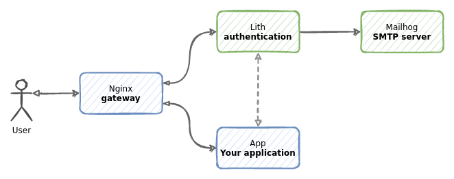

First, make sure to run `make docker-image` in the projects main directory. This will build a docker image called `lith`.

Run `docker-compose up` to start the application. You can use `-d` flag to run it in the background.

    % docker-compose up
    Starting nginx_gateway_lith-admin_1 ... done
    Starting nginx_gateway_mailhog_1    ... done
    Starting nginx_gateway_app_1        ... done
    Starting nginx_gateway_lith_1       ... done
    Starting nginx_gateway_gateway_1    ... done
    Attaching to nginx_gateway_lith-admin_1, nginx_gateway_mailhog_1, nginx_gateway_app_1, nginx_gateway_lith_1, nginx_gateway_gateway_1
    gateway_1     | /docker-entrypoint.sh: /docker-entrypoint.d/ is not empty, will attempt to perform configuration
    gateway_1     | /docker-entrypoint.sh: Looking for shell scripts in /docker-entrypoint.d/
    gateway_1     | /docker-entrypoint.sh: Launching /docker-entrypoint.d/10-listen-on-ipv6-by-default.sh
    mailhog_1     | 2021/12/05 09:23:34 Using in-memory storage
    gateway_1     | 10-listen-on-ipv6-by-default.sh: error: IPv6 listen already enabled
    nginx_gateway_lith-admin_1 exited with code 0
    mailhog_1     | 2021/12/05 09:23:34 [SMTP] Binding to address: 0.0.0.0:1025
    gateway_1     | /docker-entrypoint.sh: Launching /docker-entrypoint.d/20-envsubst-on-templates.sh
    mailhog_1     | [HTTP] Binding to address: 0.0.0.0:8025
    gateway_1     | /docker-entrypoint.sh: Configuration complete; ready for start up
    mailhog_1     | 2021/12/05 09:23:34 Serving under http://0.0.0.0:8025/
    mailhog_1     | Creating API v1 with WebPath:
    mailhog_1     | Creating API v2 with WebPath:

When successful, several services will be running.

* Nginx is running on port 8000 and serving all the traffic.
* A Python web application is runing and [you can access it via Nginx](http://localhost:8000). This is where your business logic would be.
* A Lith instance is running and you can access it via Nginx. Several endpoints are available:
  * Authentication at  http://localhost:8000/auth/login/
  * Admin panel at http://localhost:8000/admin/
* A [Mailhog](https://github.com/mailhog/MailHog) test SMTP server [with web UI running at http://localhost:8025](http://localhost:8025).

During startup an admin account `admin@example.com` with password `admin` is created. You can use it to login.

For convenience, two-factor authentication is disabled. You can enable it in the `lith.conf` by setting `RequireTwoFactorAuth = true`. Enabling two-factor authentication can be done at any time - existing accounts will be requested to update during authentication.

    % docker-compose ps
    Name                         Command               State                          Ports
    -------------------------------------------------------------------------------------------------------------------------
    nginx_gateway_app_1          python main.py                   Up
    nginx_gateway_gateway_1      /docker-entrypoint.sh ngin ...   Up       0.0.0.0:8000->80/tcp,:::8000->80/tcp
    nginx_gateway_lith-admin_1   /bin/lith -conf /etc/lith. ...   Exit 1
    nginx_gateway_lith_1         /bin/lith -conf /etc/lith. ...   Up
    nginx_gateway_mailhog_1      MailHog                          Up       1025/tcp, 0.0.0.0:8025->8025/tcp,:::8025->8025/tcp

## How it works?

When you go to http://localhost:8000, Python application will check if you have an active session by introspecting your cookies. If you provide a session cookie, a call to Lith is made to validate and introspect your token.
If you are not authenticated, Python application will display a link to Lith authentication page where you can authenticate.
